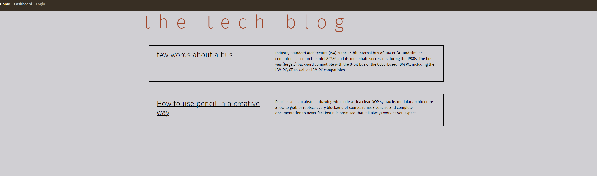

# Model-View-Controller (MVC): Tech Blog

This project is a CMS-style blog site similar to a Wordpress site, where developers can publish their blog posts and comment on other developers’ posts as well. This app follows the MVC paradigm in its architectural structure, using Handlebars.js as the templating language, Sequelize as the ORM, and the express-session npm package for authentication. Application allows creation of user acounts and a secure login. A logged in used can create new posts/blog entries and leave comments under a post. A user profile page has visibility of all created posts and allows them to be deleted.

- [Installation](#install)
- [Usage](#usage)
- [Deployed Application](https://techblog-mvc-tp4458-494945b75097.herokuapp.com/)

## User Story

- AS A developer who writes about tech
- I WANT a CMS-style blog site
- SO THAT I can publish articles, blog posts, and my thoughts and opinions

## Install

Clone project.
Run the following line of code in your terminal to install all the needed packages:

```
npm i
```

## Usage

Once all the packages have been installed build your DataBase. You can use Mysql workbench to create your DB or run command line:

```
mysql -u root -p
```

and create your DB there. Once DB has been created run in your terminal:

```
npm run seed
```

to seed your DB. Once your DB is completed go to url:

```
http://localhost:3001
```

## Built With

- Handlebars express
- Bootstrap
- JavaScript
- Sequelize
- Node.js
  - dotenv
  - express
  - express-sessions
  - bcrypt
  - mysql2
  - sequelize

## Screenshot


